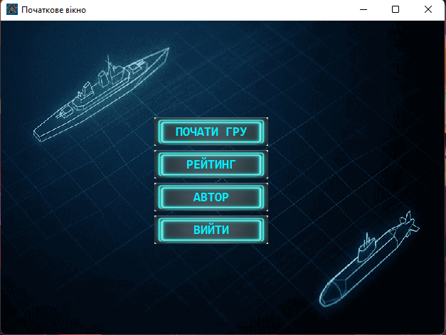
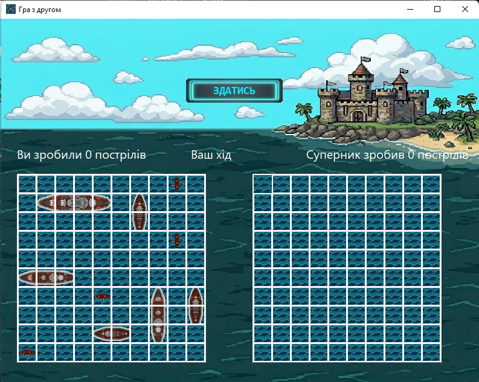

# Sea Battle Game 🚢
Мета
Розробити повноцінну десктопну гру з коректною логікою боїв, системою рейтингу та можливістю вибору режиму гри: проти штучного інтелекту (бота) або з другом по локальній мережі . 
Інструменти та технології
•	Мова: C++. 
•	Середовище: C++ Builder (VCL Framework). 
•	Компоненти: TDrawGrid (для рендерингу поля), Sockets (для мережевої гри).
Опис задачі
•	Логіка гри: Реалізація алгоритмів перевірки стану корабля (цілий/поранений/вбитий) та автоматичного заповнення клітинок навколо знищеного судна.
•	Штучний інтелект: Розробка бота з різними рівнями складності, що аналізує попередні постріли.
•	Мережевий режим: Налаштування з'єднання через локальну мережу для гри з іншим користувачем у режимі реального часу.
•	Система рейтингу: Відстеження перемог та поразок для формування статистики гравця. 
Інструкції з встановлення та запуску
Для того, щоб переглянути та протестувати проєкт, виконайте наступні кроки : 
1.	Розпакування: Завантажте та розпакуйте ZIP-архів із вихідним кодом проєкту.
2.	Відкриття: Запустіть файл проекту Sea_battle.cbproj через середовище C++ Builder.
3.	Компіляція: Натисніть кнопку Compile або Build, щоб зібрати проект під вашу систему.
4.	Запуск: Виконуваний файл буде створено за шляхом: Sea battle -> Win32 -> Debug -> Sea_battle.exe.
Код (приклад логіки пострілу)
C++
// Приклад обробки пострілу по клітинці
if (Field[x][y] == Ship) {
    Field[x][y] = Hit;
    CheckIfSunk(x, y); // Перевірка, чи не був це останній палубний блок
} else {
    Field[x][y] = Miss;
}
Результати
•	Створено стабільний ігровий додаток із графічним інтерфейсом. 
•	Реалізовано два повноцінні режими гри: синглплеєр (з ботом) та мультиплеєр (локальна мережа).
•	Впроваджено систему збереження результатів та рейтингу. 

## Visuals

## How to run
[Тут твоя інструкція про Sea_battle.cbproj...]
